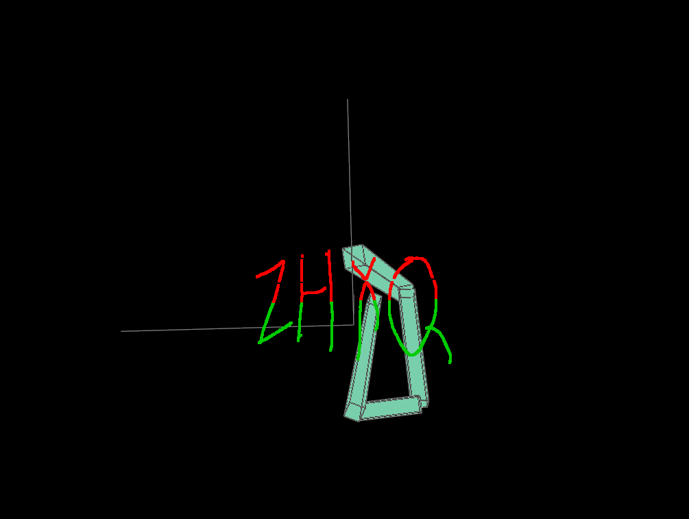
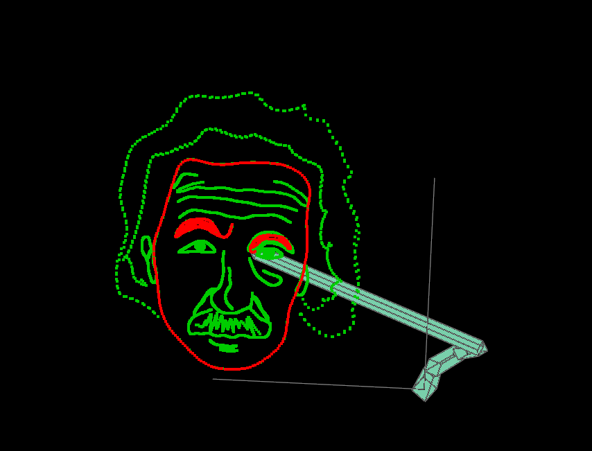
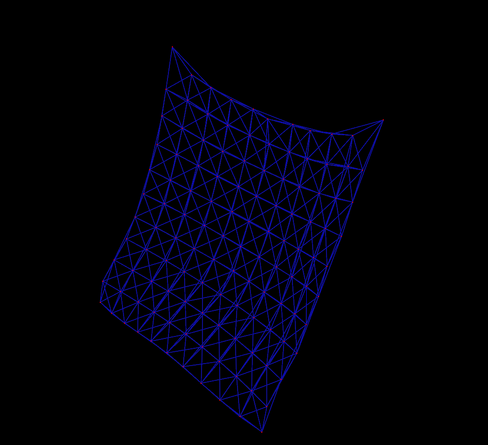

# VCL Lab 4 实验报告

**姓名：** [王泽恺]  
**学号：** [2400013155]  
---

## 目录

1. [Task 1: Inverse Kinematics (逆向运动学)](#task-1)
   - [Sub-Task 1: Forward Kinematics](#sub-task-1)
   - [Sub-Task 2: CCD IK](#sub-task-2)
   - [Sub-Task 3: FABRIK](#sub-task-3)
   - [Sub-Task 4: 自定义曲线绘制](#sub-task-4)
   - [Bonus: 轨迹优化](#bonus-ik)
2. [Task 2: Mass-Spring System (弹簧质点系统)](#task-2)


---

## <a name="task-1"></a>Task 1: Inverse Kinematics (4分 + Bonus 1分)

### <a name="sub-task-1"></a>Sub-Task 1: Forward Kinematics (0.5分)

#### 实现思路

前向运动学（FK）从根节点开始，逐级计算每个关节的全局位置和旋转。核心思想：

- **全局旋转** = 父关节全局旋转 × 当前关节局部旋转
- **全局位置** = 父关节全局位置 + 旋转后的局部偏移

#### 数学原理

对于关节链：
```
根节点(0) → 关节1 → 关节2 → ... → 末端
```

递推公式：
$$
\begin{align}
\mathbf{R}_i^{\text{global}} &= \mathbf{R}_{i-1}^{\text{global}} \cdot \mathbf{R}_i^{\text{local}} \\
\mathbf{p}_i^{\text{global}} &= \mathbf{p}_{i-1}^{\text{global}} + \mathbf{R}_{i-1}^{\text{global}} \cdot \mathbf{offset}_i
\end{align}
$$

#### 代码实现

```
void ForwardKinematics(IKSystem & ik, int StartIndex) {
    if (StartIndex == 0) {
        ik.JointGlobalRotation = ik.JointLocalRotation;
        ik.JointGlobalPosition = ik.JointLocalOffset;
        StartIndex = 1;
    }
    
    for (int i = StartIndex; i < ik.JointLocalOffset.size(); i++) {
        // 累积旋转
        ik.JointGlobalRotation[i] = ik.JointGlobalRotation[i-1] * ik.JointLocalRotation[i];
        
        // 计算全局位置
        ik.JointGlobalPosition[i] = ik.JointGlobalPosition[i-1] + 
                                    ik.JointGlobalRotation[i-1] * ik.JointLocalOffset[i];
    }
}
```


---

### <a name="sub-task-2"></a>Sub-Task 2: CCD IK (1分)

#### 算法原理

CCD（Cyclic Coordinate Descent）从末端向根部迭代优化每个关节：

1. 从倒数第二个关节开始（末端关节不旋转）
2. 计算当前关节到末端的向量 **v**
3. 计算当前关节到目标的向量 **m**
4. 求旋转四元数使 **v** 对齐到 **m**
5. 更新关节旋转并执行前向运动学
6. 重复直到收敛

#### 数学推导

对于关节 $i$，需要旋转使得：
$$
\mathbf{v} = \text{normalize}(\mathbf{p}_{\text{end}} - \mathbf{p}_i) \rightarrow \mathbf{m} = \text{normalize}(\mathbf{p}_{\text{target}} - \mathbf{p}_i)
$$

旋转四元数：
$$
\mathbf{q} = \text{rotation}(\mathbf{v}, \mathbf{m})
$$

#### 代码实现

```
void InverseKinematicsCCD(IKSystem & ik, const glm::vec3 & EndPosition, 
                          int maxCCDIKIteration, float eps) {
    ForwardKinematics(ik, 0);
    
    for (int iter = 0; iter < maxCCDIKIteration && 
         glm::l2Norm(ik.EndEffectorPosition() - EndPosition) > eps; iter++) {
        
        int n = ik.NumJoints();
        for (int i = n-2; i >= 0; i--) {
            // 当前末端方向
            glm::vec3 v = glm::normalize(ik.JointGlobalPosition[n-1] - ik.JointGlobalPosition[i]);
            
            // 目标方向
            glm::vec3 m = glm::normalize(EndPosition - ik.JointGlobalPosition[i]);
            
            // 计算旋转四元数
            glm::quat q = glm::rotation(v, m);
            
            // 更新全局旋转
            ik.JointGlobalRotation[i] = q * ik.JointGlobalRotation[i];
            
            // 更新局部旋转
            if (i == 0) {
                ik.JointLocalRotation = ik.JointGlobalRotation;
            } else {
                ik.JointLocalRotation[i] = glm::inverse(ik.JointGlobalRotation[i-1]) * 
                                            ik.JointGlobalRotation[i];
            }
            
            // 重新计算后续关节位置
            ForwardKinematics(ik, i);
        }
    }
}
```


---

### <a name="sub-task-3"></a>Sub-Task 3: FABRIK (1分)

#### 算法原理

FABRIK（Forward And Backward Reaching Inverse Kinematics）双向迭代：

**反向阶段**（从末端到根部）：
1. 将末端固定在目标位置
2. 逆向拉伸关节链，保持骨骼长度

**正向阶段**（从根部到末端）：
1. 将根部固定在原位置
2. 正向拉伸关节链，保持骨骼长度

#### 数学公式

**反向更新**：
$$
\mathbf{p}_i = \mathbf{p}_{i+1} + \frac{L_{i+1}}{|\mathbf{p}_i - \mathbf{p}_{i+1}|} (\mathbf{p}_i - \mathbf{p}_{i+1})
$$

**正向更新**：
$$
\mathbf{p}_{i+1} = \mathbf{p}_i + \frac{L_{i+1}}{|\mathbf{p}_{i+1} - \mathbf{p}_i|} (\mathbf{p}_{i+1} - \mathbf{p}_i)
$$

其中 $L_i$ 是骨骼长度。

#### 代码实现

```
void InverseKinematicsFABR(IKSystem & ik, const glm::vec3 & EndPosition, 
                           int maxFABRIKIteration, float eps) {
    ForwardKinematics(ik, 0);
    int nJoints = ik.NumJoints();
    std::vector<glm::vec3> backward_positions(nJoints), forward_positions(nJoints);
    
    for (int iter = 0; iter < maxFABRIKIteration && 
         glm::l2Norm(ik.EndEffectorPosition() - EndPosition) > eps; iter++) {
        
        // 反向阶段
        glm::vec3 next_position = EndPosition;
        backward_positions[nJoints - 1] = EndPosition;
        
        for (int i = nJoints - 2; i >= 0; i--) {
            glm::vec3 direction = glm::normalize(ik.JointGlobalPosition[i] - next_position);
            backward_positions[i] = next_position + direction * ik.JointOffsetLength[i+1];
            next_position = backward_positions[i];
        }
        
        // 正向阶段
        glm::vec3 now_position = ik.JointGlobalPosition;
        forward_positions = ik.JointGlobalPosition;
        
        for (int i = 0; i < nJoints - 1; i++) {
            glm::vec3 direction = glm::normalize(backward_positions[i+1] - now_position);
            forward_positions[i+1] = now_position + direction * ik.JointOffsetLength[i+1];
            now_position = forward_positions[i+1];
        }
        
        ik.JointGlobalPosition = forward_positions;
    }
    
    // 根据位置恢复旋转
    for (int i = 0; i < nJoints - 1; i++) {
        ik.JointGlobalRotation[i] = glm::rotation(
            glm::normalize(ik.JointLocalOffset[i + 1]), 
            glm::normalize(ik.JointGlobalPosition[i + 1] - ik.JointGlobalPosition[i])
        );
    }
    
    // 更新局部旋转
    ik.JointLocalRotation = ik.JointGlobalRotation;
    for (int i = 1; i < nJoints - 1; i++) {
        ik.JointLocalRotation[i] = glm::inverse(ik.JointGlobalRotation[i - 1]) * 
                                    ik.JointGlobalRotation[i];
    }
    
    ForwardKinematics(ik, 0);
}
```


---

### <a name="sub-task-4"></a>Sub-Task 4: 自定义曲线绘制 (0.5分)

#### 实现方案

我选择实现了从图像骨架提取轨迹的方法（Bonus 4.2）。

#### 步骤

1. **图像预处理**：使用 Python + OpenCV 提取骨架
2. **轨迹采样**：按弧长均匀采样
3. **坐标转换**：归一化到机械臂工作空间

#### Python 骨架提取代码

```
import cv2
import numpy as np
from skimage.morphology import skeletonize

# 读取图像
img = cv2.imread('input.png', 0)
_, binary = cv2.threshold(img, 127, 255, cv2.THRESH_BINARY_INV)

# 骨架化
skeleton = skeletonize(binary // 255).astype(np.uint8) * 255

# 提取骨架点
points = np.column_stack(np.where(skeleton > 0))

# 保存为轨迹文件
with open('trajectory.txt', 'w') as f:
    f.write(f"{len(points)}\n")
    for y, x in points:
        f.write(f"{x/img.shape} {y/img.shape}\n")[1]
```

#### C++ 轨迹加载

```
IKSystem::Vec3ArrPtr IKSystem::BuildCustomTargetPosition() {
    using Vec3Arr = std::vector<glm::vec3>;
    std::shared_ptr<Vec3Arr> custom(new Vec3Arr());
    
    std::ifstream file("trajectory.txt");
    if (!file.is_open()) {
        spdlog::error("无法打开 trajectory.txt");
        return custom;
    }
    
    int num_points;
    file >> num_points;
    
    float scale = 1.0f;
    float center_x = 0.0f, center_z = 0.0f, y_height = 0.0f;
    
    for (int i = 0; i < num_points; i++) {
        float x, y;
        file >> x >> y;
        
        float world_x = center_x - (x - 0.5f) * scale;
        float world_z = center_z - (y - 0.5f) * scale;
        
        custom->push_back(glm::vec3(world_x, y_height, world_z));
    }
    
    file.close();
    spdlog::info("成功加载 {} 个轨迹点", custom->size());
    return custom;
}
```

#### 效果展示



#### 使用方法

先使用ske.py文件得到trajectory.txt
将轨迹文件放到和exe文件同路径
同样完成了mnist的骨架提取，digit5_trajectory.txt即为对应轨迹，使用方法同上，但是要保证文件名字为trajectory.txt

---

### <a name="bonus-ik"></a>Bonus: 采样点均匀化 (0.5分)

#### 问题分析

函数生成的轨迹在曲率变化剧烈处采样稀疏，导致机械臂运动不连续。

#### 解决方案：弧长参数化

1. **密集采样**：先用小步长采样曲线
2. **计算累积弧长**
3. **均匀重采样**：按等间隔弧长插值

#### 实现代码（见完整代码中的注释部分）

#### 效果图
原图：

优化后：


---

## <a name="task-2"></a>Task 2: Mass-Spring System (3分)

### 问题背景

显式欧拉方法稳定性差，需要极小时间步长（1000步）才能避免爆炸。本任务要求实现**隐式欧拉**方法。

### 数学原理

#### 优化视角

将隐式欧拉转化为最小化问题：
$$
\mathbf{x}^{n+1} = \arg\min_{\mathbf{x}} \left[\frac{1}{2\Delta t^2}\|\mathbf{x} - \mathbf{y}\|^2_M + E(\mathbf{x})\right]
$$

其中：
- $\mathbf{y} = \mathbf{x}^n + \Delta t \mathbf{v}^n + \frac{\Delta t^2}{m}\mathbf{f}_{\text{ext}}$ 是惯性预测位置
- $E(\mathbf{x})$ 是弹性势能

#### 牛顿法求解

目标函数梯度：
$$
\nabla g(\mathbf{x}) = \frac{m}{\Delta t^2}(\mathbf{x} - \mathbf{y}) + \nabla E(\mathbf{x})
$$

Hessian矩阵：
$$
\mathbf{H} = \frac{m}{\Delta t^2}\mathbf{I} + \mathbf{K}(\mathbf{x})
$$

其中刚度矩阵 $\mathbf{K}$ 包含**轴向**和**切向**刚度：
$$
\mathbf{K} = \frac{k}{L}\mathbf{t}\mathbf{t}^T + k\left(1 - \frac{L_0}{L}\right)(\mathbf{I} - \mathbf{t}\mathbf{t}^T)
$$

牛顿迭代：
$$
\mathbf{x}^{k+1} = \mathbf{x}^k - \mathbf{H}^{-1}\nabla g(\mathbf{x}^k)
$$

### 实现细节

#### 关键函数

1. **`grav`**: 重力向量
2. **`damp_force`**: 阻尼力（沿弹簧方向）
3. **`grad_E`**: 弹性势能梯度（弹簧力）
4. **`y`**: 惯性预测位置
5. **`grad_g`**: 目标函数梯度
6. **`Hessian`**: 目标函数Hessian矩阵

#### Hessian矩阵计算

```
// 对角元素
if(i==j) 
    p = k * ((x01[i]*x01[j])/(len*len) + 
             (1.0 - L0/len) * (1.0 - (x01[i]*x01[j])/(len*len)));

// 非对角元素
else 
    p = k * ((x01[i]*x01[j])/(len*len) + 
             (1.0 - L0/len) * (0.0 - (x01[i]*x01[j])/(len*len)));
```

#### 主循环

```
void AdvanceMassSpringSystem(MassSpringSystem & system, float const dt) {
    int const steps = 10;
    float const ddt = dt / steps;
    
    Eigen::VectorXf x = glm2eigen(system.Positions);
    Eigen::VectorXf v = glm2eigen(system.Velocities);
    
    for (int s = 0; s < steps; s++) {
        // 牛顿步：求解位置
        x += ComputeSimplicialLLT(Hessian(system,x,ddt), -grad_g(system,x,v,ddt));
        
        // 更新速度
        v += ((damp_force(system,x,v) - grad_E(system,x)) / system.Mass - grav(system)) * ddt;
    }
    
    // 更新系统状态
    auto newx = eigen2glm(x), newv = eigen2glm(v);
    for (size_t i = 0; i < system.Positions.size(); i++) {
        if (!system.Fixed[i]) {
            system.Velocities[i] = newv[i];
            system.Positions[i] = newx[i];
        }
    }
}
```


### 最终效果



---

## <a name="questions"></a>问题回答

### Question 1: 如果目标位置太远，无法到达，IK 结果会怎样？

**回答**：

- **CCD**: 机械臂会尽可能伸展，所有关节朝目标方向对齐，但末端无法到达。迭代会在最大步数后停止，残差不为零。
  
- **FABRIK**: 反向阶段会过度拉伸关节链，正向阶段拉回时产生累积误差。最终结果是机械臂完全伸直指向目标，但长度不足。


---

### Question 2: 比较 CCD IK 和 FABR IK 所需要的迭代次数


- **FABRIK更快**：双向同时优化，每次迭代调整所有关节
- **CCD较慢**：单向逐个优化，信息传递慢


---

### Question 3: 由于 IK 是多解问题，在个别情况下，会出现前后两帧关节旋转抖动的情况。怎样避免或是缓解这种情况？


**解决方案**：

1. **时间平滑**：
   $$
   \mathbf{q}_{\text{final}} = (1-\alpha)\mathbf{q}_{\text{prev}} + \alpha \mathbf{q}_{\text{IK}}
   $$
   其中 $\alpha \in [0.1, 0.3]$ 是平滑系数。

2. **正则化**：在优化目标中添加关节角变化惩罚：
   $$
   \min_{\mathbf{q}} \|f(\mathbf{q}) - \mathbf{p}_{\text{target}}\|^2 + \lambda \|\mathbf{q} - \mathbf{q}_{\text{prev}}\|^2
   $$

3. **速度限制**：限制每帧最大旋转角度：
   ```
   float max_rotation = 10.0f * dt;  // 度/秒
   if (angle_change > max_rotation) {
       q = slerp(q_prev, q_ik, max_rotation / angle_change);
   }
   ```

4. **使用FABRIK**：相比CCD，FABRIK运动更连续，天然减少抖动。
